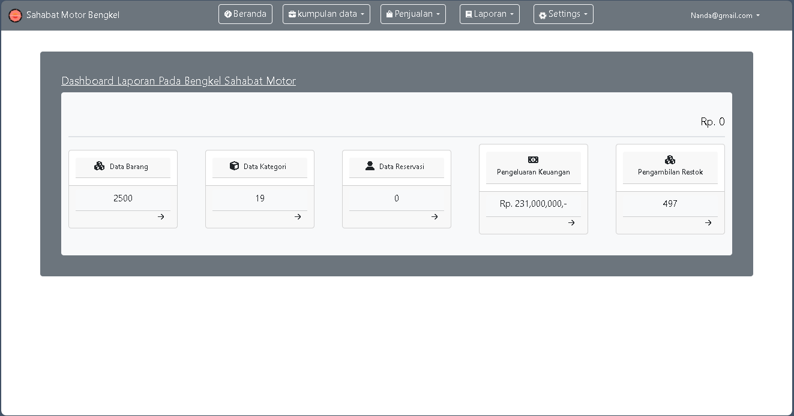
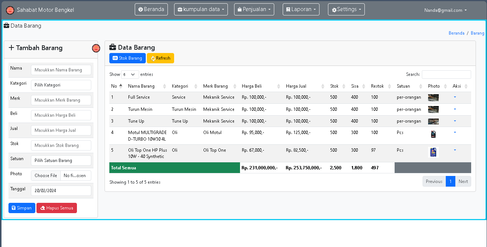
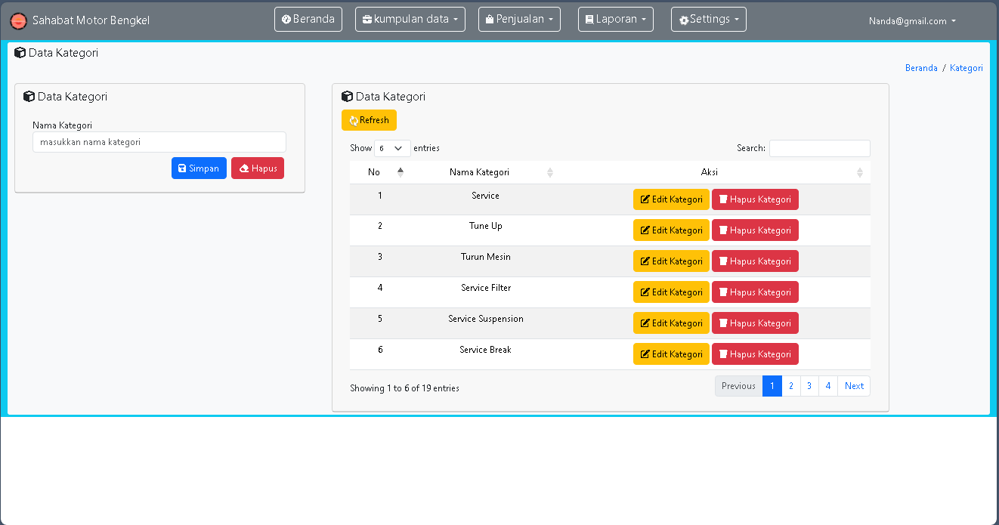

# Bengkel version 2

1. Bengkel v2 ini di utamakan pada Fitur Reservasi Bengkel pada umumnya, seperti :
   <ol type="1">
     <li>Tanggal</li>
     <li>Jam</li>
     <li>Plat Mobil</li>
     <li>Kategori reservasi</li>
     <li>Merk Mobil</li>
     <li>Nama Konsumen</li>
   </ol>
   
2. Bengkel v2 ini harus ada Fitur di dashboard admin seperti :
   <ol type="1">
     <li>Beranda</li>
     <li>Sistem Kasir & pembuatan voucher</li>
     <li>Laporan Keuangan & Laporan Reservasi</li>
     <li>Data Barang : Barang, & Kategori Barang</li>
     <li>Fitur print setiap data contoh : laporan keuangan, laporan reservasi, & barang</li>
     <li>Settings : admin sistem informasi, edit account & log out</li>
   </ol>

3. Bengkel v2 ini harus ada Fitur di dashboard konsumen seperti :
   <ol type="1">
     <li>Beranda</li>
     <li>Pembuatan Reservasi</li>
     <li>Fitur print setiap data contoh : laporan reservasi</li>
     <li>Settings : edit account & log out</li>
   </ol>

Photo Dashboard Terbaru :
  
Photo Data Barang :
  
Photo Data Kategori :
  
